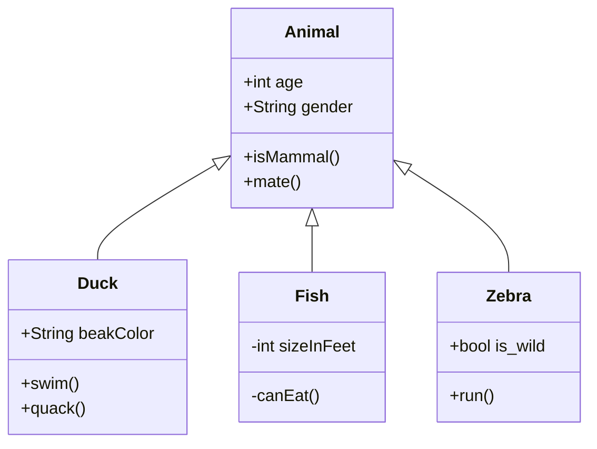

# 7장

이제 실제 적용하고 코드로 구현하는것을 보여줬다

사실상 정리하고 뭐할건 없는것 같고 

실제 이번 미션에서 적용해보고 있는데 나쁘지 않은것 같다.

기회가 된다면 UML을 공부하고 관련 플러그인깔아서 예쁘게 만들어놓고 개발을 시작해야겠다는 생각이 든다.

제이슨의 조언:

Mermaid 를 사용해봐라

https://mermaid.js.org/intro/

코드블럭에 mermaid 설정해주면 UML 보임 ^^

봤냐? 개쩐다